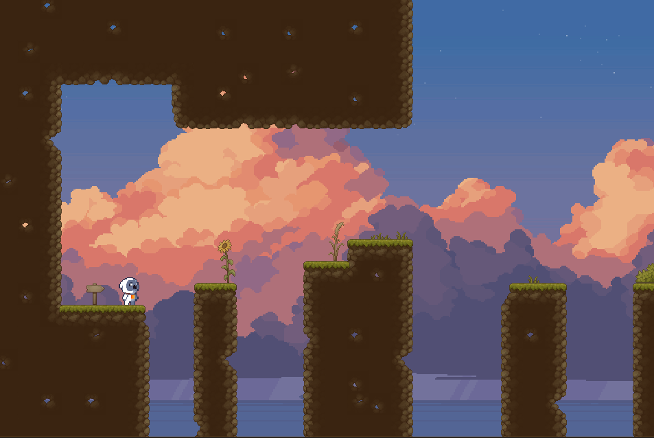
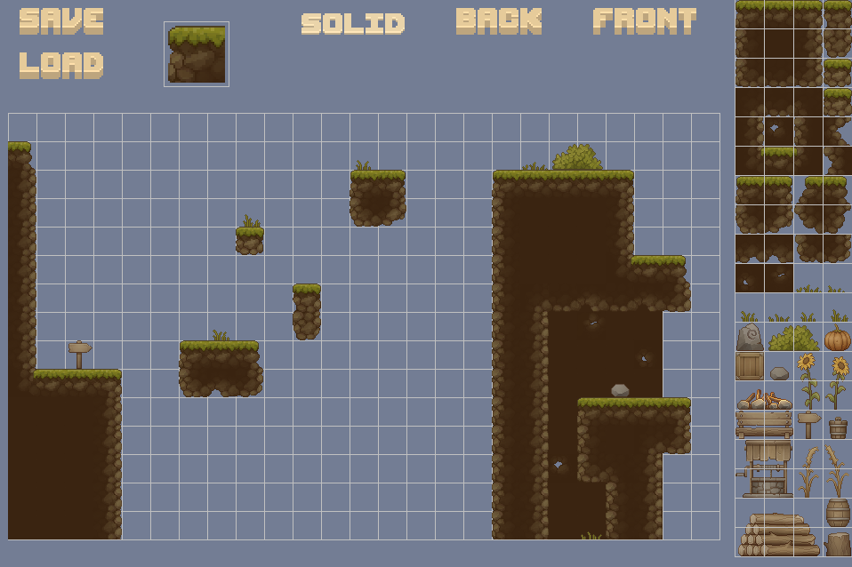

# Hippity Hop

## About Game

### Description
Platformer type game made using java for University project in 2 weeks. Player and tile graphics are taken from the web. UI was drawn by me.
This game also has a map editor included, you can open it in the main menu.
The collision system is based on tile map so it is not perfect for funny shaped objects.

### Controls
* `Move left/right` - __A D__
* `Jump` - __W / SPACE__

### To-Do
- [ ] Include a health system.
- [ ] Add some kind of enemies.
- [ ] Implement coin system.
- [ ] Add the main goal.

## About Map Editor

### Description
Map Editor was written in the same time period as the game (during those 2 weeks) for easier physics testing and to fulfill project requirments. It is writen in pure java using java.swing library for image drawing and editing.
Map saving and loading system needs improvements, because there is no way to know the level names for a person who doesnt have access to the project files.
Also the map tile loading system should be updated to have a scrollable tab so that it could fit an undefined amount of tiles (Now its capped at 76).
The editor has __3__ layers which are always seen by the user, they can be changed by pressing buttons at the top (solid, back, front). Only the solid layer has collisions in the game. 
### Controls
* `Move map` - __W A S D__
* `Place/Select` - __LEFT CLICK__
* `Remove` - __RIGHT CLICK__

### To-Do
- [ ] Add ability to place objects by holding mouse button.
- [ ] Add selectable area for drawing.
- [ ] Change the tile loading system for more options.
- [ ] Improve map loading and saving for easier use.

## License
Feel free to use this code anywhere, anyhow😎

